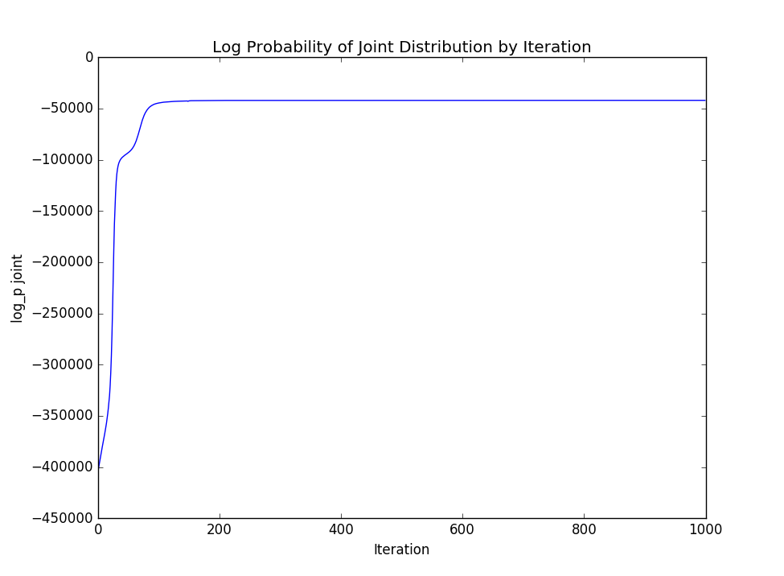
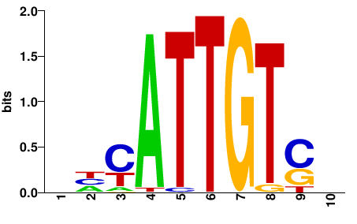
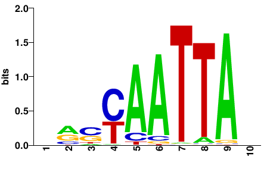
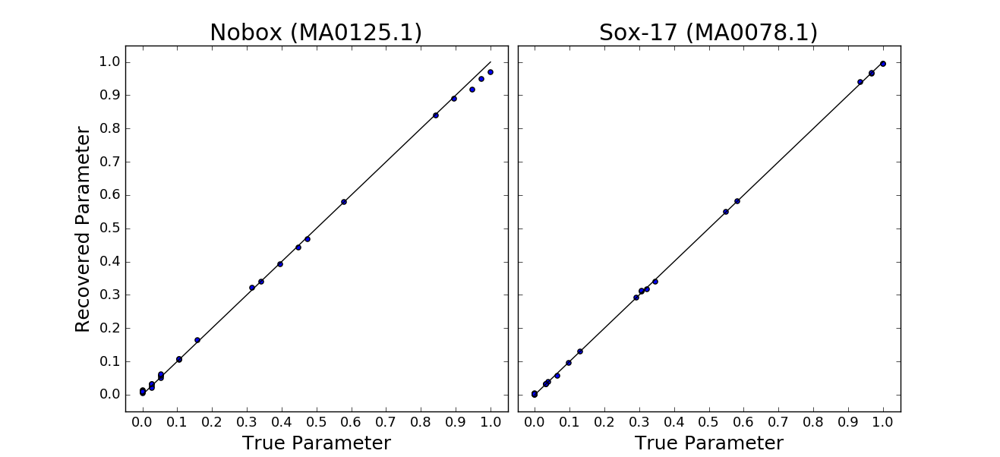

# The K-mer motif multinomial mixture, a scalable framework for multiple motif discovery
Brian Trippe and Harmen Bussemaker

The K-mer motif multinomial mixture (KMMM) is a Bayesian framework for multiple motif discovering that learns motifs from K-mer tables.  Unlike previous models, the KMMM allows for inference whose time complexity does not scale with the quantity of sequence, rather the only the preprocessing (i.e. the creation of the K-mer table) has complexity linear in the length of sequence.

To discover motifs, we first create a K-mer table, and then run a Gibbs sampler, indicating aspects of the motifs and background model that fit the specific motif discovery problem we are trying to solve.

## Requirements
* Python 2.7
* numpy, scipy
* multiprocessing
* [REDUCE\_Suite](http://bussemakerlab.org/forum/), for creating motif logos

## Usage

### Preprocessing
Creating a K-mer table from sequence is the preprocessing step that must be undertaken to fit a KMMM.  This is the only stage whose time complexity scales  with the quantity of sequence used.

Because we may be interested in working with sequence sets that may be many millions of bases long, we wrote program to create a K-mer table in C.

```sh
make -C data_prep
./data_prep/create_kmer_table K sequences.fa > kmer_table.fa
```

This will create a K-mer table from all of the sequences included in the given fasta file and print it to standard output.

### Inference
To perform inference of a KMMM we use a Gibbs sampler written in python.  Since the KMMM is more of a framework for motif discovery than it is a specific model, a number of model parameters must be specified.  In the provided example for running on synthetic data, we have used the following parameters:

```sh
python inference/gibbs_sampler.py \
    -kmer_table example/dat/kmer_table_condensed.txt \
    -I 1000  \
    -o example/out \
    -log log \  # skip flag to log to stdout
    -n_jobs 4 \ # set to one if you can only use one process
    -pi 5.0 \
    -bg_static \ # this is useful since we know that background model is static
    -n_motifs 2 \ 
    -alpha_bg 100000 \
    -alpha_m 6000 \
    -log_p_longer -100.0
```

The bottleneck step in inference is sampling the component assignments of each K-mer.  This is easily parallelized because, conditional on motifs and component proportions, these variable are conditionally independent.  We parallelize this using the multiprocessing library in Python.  This step is still nonetheless time consuming, because for each of the 4<sup>K</sup> K-mers, we loop through each of the 2\*(2\*K -1)\*M components in Python, and use Numpy to calculate their likelihoods based on the segments thereby attributed to motif and background.  A faster re-implementation of this part of our sampling procedure would significantly improve the efficiency of inference.

### Analysis

##### Plotting Log Joint throughout sampling
If we are interested in viewing the log probability of the joint distribution throughout the iterations of Gibbs sampling, we can view it by parsing it out of the log file:

```sh
grep -E "log_p joint"  < example/out/log | awk '{print $3}' | python analysis/plot_points.py
```
To get a plot like:




##### Creating Motif Logos
To view the motif logos we use the REDUCE\_Suite LogoGenerator.  We have written a script that calls the LogoGenerator on the intermediate and final motif logos:
```sh
./analysis/create_motif_logos.sh <result_dir> <n_motifs>
```
Where, in our case, the result directory is `example/out` and the number of motifs is `2`.

The final motifs learned in our test trial are:





### Evaluating Performance
For tasks in which we wish to identify motifs in real biological sequence, it is difficult to quantify how "correct" the motifs discovered are.  We can perhaps most descriptively describe goodness of fit based on how well the motifs align with our prior expectations as well as how well they explain the data, which we do by looking at the log probability of the joint distribution. 

However, in the case of the synthetic sequence we have used in the example, we do in fact have a "correct" answer for what the motifs should be, i.e. the motifs we used to generate the sequence.  To assess the performance on this data, we find the best alignment of the learned motifs with the true pwms used to generate sequence, and compare the motif parameters against one another.

We implemented this method of comparison, which can be called as:
```sh
python evaluate_motifs.py <MA0125_psam_fn> <MA0078_psam_fn> <fit_motif_1> <fit_motif_2>
```
This calculates an R<sup>2</sup> for the fits a provides a visualization as:




### Bayesian Nonparametric Motif shape learning
An additional element of the model which is not explained how the shape of the motif is found.

This is a necessary task because otherwise it is possible to learn a motif that is a frame-shifted version of a real motif.  In this case, if we do not adapt to the scenario, we will lose some of the signal.  We have solved this problem by considering the positions in the motifs that describe the distribution of bases with which it is aligned as additional latent variable.  We fit this during the motif update steps of the Gibbs sampler.  This is done by placing an truncated geometric prior on the length of motifs, and considering the posterior predictive probability of observing bases at the edge of motifs given the Dirichlet prior on motif parameters vs observing those same bases as part of the background distribution.

The parameter governing this truncated geometric distribution are set by the `log_p_longer` and `min_len` arguments of the Gibbs sampler.
